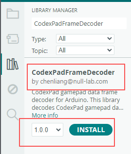

# CodexPad Frame Decoder Arduino lib

[中文](README.zh-CN.md)

## Overview

This library is a **data frame decoder** for the **CodexPad** series gamepads on the **Arduino** platform. It receives raw byte streams via a `Stream` object, parses the data protocol frames, and extracts button states and joystick axis values. It is suitable for scenarios where gamepad data is received through a serial or Bluetooth transparent transmission module.

**The library itself does not handle Bluetooth connections**; it only handles the verification and parsing of the gamepad data protocol frames. For details on how to establish a Bluetooth connection (e.g., by sending AT commands), please refer to the `Connect()` function in the specific examples.

For detailed information about CodexPad products, please refer to the following product documentation.

| CodexPad Model | Details |
| :--- | :--- |
| CodexPad-C10 | [Product Details](../../../codex_pad_c10/blob/main/README.md#codexpad-c10) |
| CodexPad-S10 | [Product Details](../../../codex_pad_s10/blob/main/README.md#codexpad-s10) |

## Supported Platforms

This library relies only on the `Stream` interface. It receives and parses CodexPad gamepad data protocol frames via `Stream` and is not concerned with the Bluetooth connection process or bound to any specific hardware. It is suitable for any Arduino-compatible platform that supports `Stream` input, including those using an external Bluetooth transparent transmission module (such as BLE-UNO, NL-16, etc.).

## Features

- **Real-time Button Event Detection**: Reads the input status of all buttons in real-time, and distinguishes between three events: **pressed**, **released**, and **holding**.

- **High-Precision Joystick Data**: Retrieves the analog values of the left and right joystick X and Y axes, ranging from 0 to 255, providing precise control input.

- **Reliable Data Frame Decoding**: Built-in robust_frame protocol parser, supporting frame synchronization, escape reversal, and CRC-8 integrity verification.

## Usage Instructions

### Preparation

Before starting programming, please complete the following preparations to ensure a smooth development process.

#### Familiarize Yourself with Product Documentation

- Read the datasheet of the Bluetooth module you are using (e.g., the NL-16 Bluetooth module) carefully to understand how to use it, how to connect, and the corresponding AT commands.

- Read the CodexPad product manual thoroughly to fully understand the hardware features, the gamepad's button and joystick layout, function definitions, indicator light status, and basic operations like powering on/off.

#### Obtain and Record the Gamepad's **Bluetooth Device Address (BD_ADDR)**

> **⚠️ Important Notice**: The examples in this library connect using the **Bluetooth Device Address (BD_ADDR)**. **When programming, you must explicitly specify your gamepad's Bluetooth Device Address (BD_ADDR) in the code.**

Please refer to the method provided in the product manual to obtain your gamepad's **Bluetooth Device Address (BD_ADDR)**. Its format is typically `"0C:3D:5E:9D:80:99"` (consisting of characters 0-9, A-F, with colons as separators). Please keep this information safe, as you will need to replace it with your own gamepad's actual **Bluetooth Device Address (BD_ADDR)** in the code later.

#### Power on the Gamepad and Enter Connection Standby State

- Power on the gamepad. After powering on, the gamepad will automatically enter a **connection standby state** where it is discoverable via Bluetooth. At this time, the gamepad's indicator light should be **slowly flashing (approximately once per second)**.

### Installing CodexPad Frame Decoder Library

1. **Open Arduino IDE Library Manager**
   - Menu: **Tools** → **Manage Libraries...**
   - Keyboard shortcut: `Ctrl+Shift+I` (Windows/Linux) or `Cmd+Shift+I` (Mac)

2. **Search and Install**
   - In the search box, type: `CodexPadFrameDecoder`
   - Locate the CodexPadFrameDecoder library
   - **Ensure the latest version is selected** in the version dropdown
   - Click the **INSTALL** button

   

   > **📌 Note:** The screenshot is for reference only. Please make sure to install the latest available version.

## Example Descriptions

Examples are organized in two levels: **functionality** and **Bluetooth module**: `examples/<functionality>/<Bluetooth module>/`.

Each functionality example contains exclusive subdirectories for different Bluetooth modules. The `Connect()` function implementation in each module's exclusive example differs to ensure the correct Bluetooth connection; the parsing part uniformly uses this library's `CodexPadFrameDecoder` class. You can choose the corresponding Bluetooth module example based on the module you are using.

### Basic Polling Example (`basic_polling`)

- **Example Description**: Connects to the CodexPad via Bluetooth Device Address and queries and prints all its button states and joystick values in real-time.

- **BLE-UNO / NL-16 Bluetooth Module Example Location**: In the Arduino IDE, find this example via **File** → **Examples** → **CodexPadFrameDecoder** → **basic_polling** → **ble_uno_or_nl_16_module**.

### Input State Detection Example (`inputs_detection`)

- **Example Description**: Connects to the CodexPad via Bluetooth Device Address and prints messages upon detecting changes in button states and joystick values.

- **BLE-UNO / NL-16 Bluetooth Module Example Location**: In the Arduino IDE, find this example via **File** → **Examples** → **CodexPadFrameDecoder** → **inputs_detection** → **ble_uno_or_nl_16_module**.

## API Reference

Details link: <https://codexpad.github.io/codex_pad_frame_decoder_arduino_lib/html/en/annotated.html>

## License

This project is licensed under the MIT License - see the [LICENSE](LICENSE) file for details.
