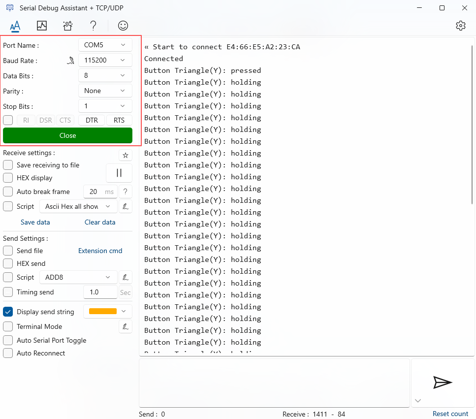

# CodexPadFrameDecoder Arduino lib

[中文版](README.zh-CN.md)

## Overview

This library is a **data frame parser** for the **CodexPad** series controllers on the **Arduino** platform. It receives raw data byte streams through a `Stream` object, parses the data protocol frames, and extracts button states and joystick axis values. Suitable for **scenarios where CodexPad controller data is received via a serial-to-Bluetooth transparent transmission module**.

This library focuses on data frame validation and parsing, and is not responsible for establishing Bluetooth connections. For how to establish a Bluetooth connection (e.g., sending AT commands), please refer to the `Connect()` function in the specific examples.

> **💡 About `Stream`**: `Stream` is a base class in the Arduino core library for data stream communication. It defines the reading and parsing functionality in Arduino and provides a unified interface for all serial communications. Common classes like `HardwareSerial` and `SoftwareSerial` inherit from `Stream`, and `Serial` is a predefined instance of `HardwareSerial`. For more details on `Stream`, see the [Arduino Stream official documentation](https://docs.arduino.cc/language-reference/en/functions/communication/stream/).

For detailed information about CodexPad products, please refer to the following product documentation.

| CodexPad Model | Details |
| :--- | :--- |
| CodexPad-C10 | [Product Details](../../../codex_pad_c10/blob/main/README.md#codexpad-c10) |
| CodexPad-S10 | [Product Details](../../../codex_pad_s10/blob/main/README.md#codexpad-s10) |

## Supported Platforms

This library and the example code are suitable for **scenarios where CodexPad controller data is received via a serial-to-Bluetooth transparent transmission module**. The following two connection options are supported:

- Development board with integrated Bluetooth transparent transmission module (no external Bluetooth module required)

    Suitable for development boards that **integrate a Bluetooth transparent transmission module** on-board. The main control communicates with the Bluetooth chip via serial, working the same way as a development board + external Bluetooth transparent transmission module (e.g., Arduino + NL-16).

    | Compatible Development Boards |
    | :-------- |
    | BLE-UNO   |

- Development board with external Bluetooth transparent transmission module

    Suitable for development boards that **do not have an integrated Bluetooth transparent transmission module** (e.g., Arduino UNO, Nano). An external serial Bluetooth transparent transmission module (e.g., NL-16) is required to use the CodexPad controller.

    **Supported external Bluetooth transparent transmission modules**

    | Bluetooth Transparent Transmission Module |
    | :------------ |
    | NL-16 (V1.2+) |

    **Supported hardware platforms**

    | Supported Hardware Platforms |
    | :--- |
    | Arduino UNO  |
    | Arduino Nano |

## Features

- **Real-time button event detection**: Real-time reading of all button input states, distinguishing between **press**, **release**, and **long press** events.

- **High-precision joystick data**: Obtain analog values of the left and right joystick X and Y axes, ranging from 0 to 255, providing precise control input.

## Usage

### Preparation

Before starting programming, please complete the following preparations to ensure a smooth development process.

#### Familiarize yourself with product documentation

- Carefully read the data sheet of the Bluetooth module you are using (e.g., NL-16 Bluetooth module) to become familiar with how to use it, how to connect, and the basic AT commands.

- Carefully read the CodexPad product manual to fully understand the hardware features, familiarize yourself with the button/joystick layout, function definitions, indicator light states, power on/off operations, and other basic information.

#### Obtain and record the controller's **Bluetooth Device Address (BD_ADDR)**

> **⚠️ Important Note**: The examples in this library connect via **Bluetooth Device Address (BD_ADDR)**. **When programming, you must explicitly specify your controller's Bluetooth Device Address (BD_ADDR) in the code.**

Please refer to the product manual for the method to obtain your controller's **Bluetooth Device Address (BD_ADDR)**. Its format is typically `"0C:3D:5E:9D:80:99"` (composed of characters 0-9, A-F, with half-width colons). Keep this information properly recorded, as you will need to replace it with your actual controller's **Bluetooth Device Address (BD_ADDR)** in the code.

#### Power on the controller and enter the ready-to-connect state

- Power on the controller. After powering on, it will automatically be in a **ready-to-connect state** where Bluetooth is discoverable. At this time, the controller indicator light should **blink slowly (approximately once per second)**.

### Installing the CodexPadFrameDecoder Library

1. **Open the Arduino IDE Library Manager**

   - Menu bar: **Tools** → **Manage Libraries...**

   - Shortcut: `Ctrl+Shift+I` (Windows/Linux) or `Cmd+Shift+I` (Mac)

2. **Search and install**

   - Enter in the search box: `CodexPadFrameDecoder`

   - Locate the CodexPadFrameDecoder library

   - **Make sure to select the latest version from the dropdown**

   - Click the **Install** button

    

    > **📌 Note:** The screenshot is for reference only. Please ensure you install the latest available version.

## Example Descriptions

Examples are organized in two levels: **Bluetooth module** and **function**: `examples/<Bluetooth module>/<function>/`.

Each Bluetooth module directory contains functional examples supported by that module. The module-specific `Connect()` function implementations differ to ensure correct Bluetooth connection; the parsing part uniformly uses this library's `CodexPadFrameDecoder` class. You can choose the appropriate functional example based on the Bluetooth module you are using.

### Bluetooth Modules

#### BLE-UNO Development Board

The BLE-UNO development board has an integrated Bluetooth chip on-board, **no external Bluetooth transparent transmission module required**.

##### Available Examples

###### Basic Polling Example (`basic_polling`)

- **Description**: Connects to CodexPad via Bluetooth Device Address, polls, and prints all button states and joystick values in real time.

- **Example location**: In Arduino IDE, find the example via **File** → **Examples** → **CodexPadFrameDecoder** → **ble_uno_or_nl_16_module** → **basic_polling**.

###### Input State Detection Example (`inputs_detection`)

- **Description**: Connects to CodexPad via Bluetooth Device Address, prints button states and joystick values only when they change.

- **Example location**: In Arduino IDE, find the example via **File** → **Examples** → **CodexPadFrameDecoder** → **ble_uno_or_nl_16_module** → **inputs_detection**.

##### Wiring Instructions

To view the debug information output by the program, simply bring out the debug serial port.

| BLE-UNO Pin | USB-to-TTL Module Pin |
| :----------- | :-------------- |
| 5            | RXD             |
| 6            | TXD             |
| 3.3V         | 3V3             |
| GND          | GND             |

> **📌 Tip**: The pin numbers (5, 6) in the table above are the default configurations in the example code. If you modify the debug serial pins in your code, please refer to your actual configuration (`kDebugSerialRxPin` and `kDebugSerialTxPin`).

#### NL-16 Bluetooth Transparent Transmission Module

The NL-16 Bluetooth transparent transmission module needs to be used with a development board.

> Please use firmware version v1.2 for the NL-16 Bluetooth transparent transmission module to ensure compatibility with CodexPad controllers.

##### Available Examples

###### Basic Polling Example (`basic_polling`)

- **Description**: Connects to CodexPad via Bluetooth Device Address, polls, and prints all button states and joystick values in real time.

- **Example location**: In Arduino IDE, find the example via **File** → **Examples** → **CodexPadFrameDecoder** → **ble_uno_or_nl_16_module** → **basic_polling**.

###### Input State Detection Example (`inputs_detection`)

- **Description**: Connects to CodexPad via Bluetooth Device Address, prints button states and joystick values only when they change.

- **Example location**: In Arduino IDE, find the example via **File** → **Examples** → **CodexPadFrameDecoder** → **ble_uno_or_nl_16_module** → **inputs_detection**.

##### Wiring Instructions

The development board used is Arduino UNO as an example:

**Arduino UNO to NL-16 Bluetooth Transparent Transmission Module Wiring**

| Arduino UNO Pin | NL‑16 Pin |
| :--------------- | :--------- |
| 5V               | +5V        |
| GND              | GND        |
| RX0              | TXD        |
| TX0              | RXD        |
| RESET            | STAT/D-RST |

**Arduino UNO to USB-to-TTL Module Wiring**

| Arduino UNO Pin | USB-to-TTL Module Pin |
| :--------------- | :-------------- |
| 5                | RXD             |
| 6                | TXD             |
| 3.3V             | 3V3             |
| GND              | GND             |

> **📌 Tip**: The pin numbers (5, 6) in the table above are the default configurations in the example code. If you modify the debug serial pins in your code, please refer to your actual configuration (`kDebugSerialRxPin` and `kDebugSerialTxPin`).

### How to View Debug Information

After the example program runs, debug information (such as button events, joystick values, etc.) is output through the **debug serial port**. Since the default hardware serial port (D0/D1) is occupied by the Bluetooth module, you cannot view debug information through that serial port. Therefore, you need to view the output through the debug serial port. Please follow these steps:

1. According to the wiring instructions above, connect the **USB-to-TTL module** to the corresponding debug serial pins (default pin numbers are 5, 6).

2. Burn the example program to the development board.

3. After burning is complete, power on the development board to run the program.

4. Plug the USB-to-TTL module into a USB port on your computer. The system will recognize a new serial port (COM port).

5. Open any serial debugging tool.

6. Select the serial port (COM port) corresponding to the USB-to-TTL module, and set the baud rate to **115200**, data bits **8**, stop bits **1**, parity **None**.

7. Click "Open Serial Port" to view the debug information in real time.

> **📌 Tip**:
>
> 1. The debug serial pin numbers (5/6) and baud rate (115200) above are the default values in the example code. If you modify the debug serial pins or baud rate in your code, please refer to your actual configuration.
> 2. After successful connection, you will see a `Connected` prompt in the debug serial port. When you press a button or move a joystick on the controller, the corresponding state changes will be printed immediately, for example `Button Triangle(Y): pressed`, `L(X:128, Y:0)`, etc.

## API Documentation

Detail link: <https://codexpad.github.io/codex_pad_frame_decoder_arduino_lib/html/annotated.html>

## License

This project is licensed under the MIT License - see the [LICENSE](LICENSE) file for details.
